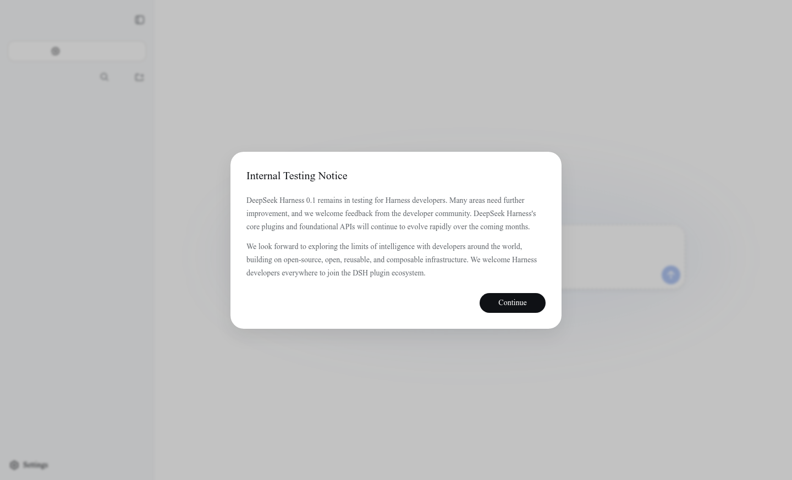
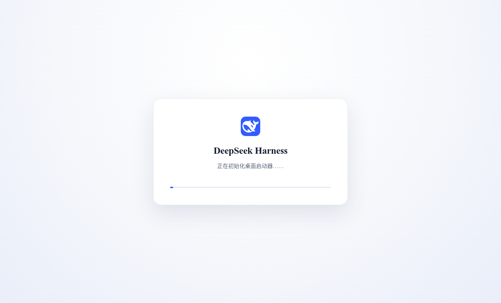

# DeepSeek Harness Desktop

[](https://github.com/VickylastShao/deepseek-harness-desktop/releases/latest)
[](https://github.com/VickylastShao/deepseek-harness-desktop/actions/workflows/build-installers.yml)
[](LICENSE)

English | [简体中文](README.zh-CN.md)

Run DeepSeek Harness like a desktop app. No terminal window, system-wide
Node.js installation, or local native build toolchain is required.

<p align="center">
  
</p>

> [!IMPORTANT]
> This is an unofficial community project, not a DeepSeek product. The upstream
> DeepSeek Harness project is currently a developer preview and may introduce
> breaking changes.

## What is DeepSeek Harness?

[DeepSeek Harness](https://github.com/deepseek-ai/deepseek-harness), also known
as `dsh`, is an open-source agent harness developed by DeepSeek. Its default Web
UI lets you connect a model provider, choose a workspace, start sessions, and
review approval-sensitive operations from a browser-based interface.

The agent can work with files, run commands, delegate tasks, and maintain a
plan under the active permission policy. Harness is built on
[Cordis](https://github.com/cordiverse/cordis) around an "everything is a
plugin" architecture: model adapters, tools, persistence, sandbox policies,
the Web UI, and even the agent loop are composed as replaceable plugins.

See the upstream [Web UI guide](https://github.com/deepseek-ai/deepseek-harness/blob/master/docs/user/guide/index.md)
and [architecture documentation](https://github.com/deepseek-ai/deepseek-harness/blob/master/docs/architecture.md)
for the authoritative description of Harness itself.

## Why a desktop wrapper?

The official quick-start command is:

```bash
npx @deepseek-ai/dsh web
```

That is ideal for developers, but it requires a terminal, Node.js, npm, and
native dependencies that may need a compiler. DeepSeek Harness Desktop packages
that setup into a conventional application:

| Desktop capability | What it changes for the user |
| --- | --- |
| Self-contained runtime | Ships its own Node.js and platform-native Harness runtime. |
| One-click launch | Starts Harness in the background with no visible terminal. |
| System tray lifecycle | Closing the window keeps Harness running; reopen, restart Harness, view logs, or quit from the tray. |
| Local-only bridge | Loads only the Harness server started on a random `127.0.0.1` port. |
| Staged Harness updates | Downloads and verifies a newer runtime while the current session keeps running. |
| Safe next-launch activation | Switches to the staged runtime on the next normal start, with the bundled runtime kept as a fallback. |
| Native installers | Produces Windows, Ubuntu, Intel macOS, and Apple Silicon macOS packages. |

## Install

Download the package for your platform from the
[latest release](https://github.com/VickylastShao/deepseek-harness-desktop/releases/latest):

| Platform | Packages |
| --- | --- |
| Windows x64 | NSIS installer (`.exe`) |
| Ubuntu x64 | Debian package (`.deb`) or portable AppImage |
| macOS Intel | `.dmg` or `.zip` |
| macOS Apple Silicon | ARM64 `.dmg` or `.zip` |

Current builds are unsigned. Windows SmartScreen and macOS Gatekeeper may show
an unknown-publisher warning until platform signing and Apple notarization are
configured.

## First launch

1. Install and open **DeepSeek Harness Desktop**.
2. Read and accept the upstream developer-preview notice.
3. Open **Settings → Models** and configure a model provider.
4. Choose the workspace that Harness is allowed to use.
5. Start a new session and describe the task you want the agent to perform.

The desktop app uses your home directory as the initial working directory.
Set `DSH_DESKTOP_WORKSPACE` before launch to choose a different default.

Closing the main window hides it instead of stopping an active Harness session.
The first close shows a native reminder that the app is still running. Use the
system tray menu to reopen the window, restart Harness, open the log folder, or
quit completely. Starting the app again restores the existing window rather
than launching a second Harness process.

## Screenshots

<table>
  <tr>
    <td align="center"><strong>Desktop launcher startup</strong></td>
    <td align="center"><strong>Harness Web UI on first run</strong></td>
  </tr>
  <tr>
    <td></td>
    <td></td>
  </tr>
</table>

Both images are captured from a real local Electron session running the bundled
Harness runtime. The repository includes the capture script used to regenerate
them.

## Updates that do not interrupt your session

Launching the app never waits for a network request. Thirty seconds after
Harness starts successfully, the updater checks the desktop runtime channel;
when no update is available, it checks again every six hours.

If a newer Harness runtime is published for the current operating system and
CPU architecture, the app downloads it in the background and verifies:

- HTTPS transport and the declared archive size
- SHA-256 and npm integrity metadata
- the required Node.js version
- the Harness CLI entry point
- the platform-native `node-pty` module

The running process is never replaced. A verified update is staged and becomes
active on the next normal launch. A failed download or integrity check leaves
the current runtime untouched. This channel updates **DeepSeek Harness**, not
the Electron shell; new desktop-app releases remain available on GitHub.

## Security and local data

- The renderer has Node.js integration disabled and Chromium context isolation
  enabled.
- The window accepts navigation only to its packaged loading page and the exact
  loopback origin reported by the managed Harness process.
- External links are handed to the system browser and are limited to HTTP or
  HTTPS URLs.
- Harness state, managed runtimes, staged updates, and desktop logs live under
  Electron's per-user application-data directory.
- Choosing **Quit** from the system tray terminates the Harness process tree and
  cancels any in-flight background download.
- Uninstalling the app does not delete user data by default.

## Development

Node.js `24.18.1` is required. Preparing the seed downloads DeepSeek Harness
from the official npm registry and builds its native dependencies for the
current platform.

```bash
npm ci
npm test
npm run smoke:tray
npm run prepare:seed
npm run smoke:harness
npm run dist
```

To regenerate the README screenshots from a graphical desktop session:

```bash
npm run capture:screenshots
```

Generated runtime and installer directories (`runtime-seed/`,
`runtime-release/`, `build/`, and `release/`) are excluded from Git.

## Runtime configuration

| Environment variable | Purpose | Default |
| --- | --- | --- |
| `DSH_RUNTIME_CHANNEL_URL` | Override the HTTPS runtime-channel manifest. | Embedded release channel |
| `DSH_UPDATE_DELAY_MS` | Delay before the first background update check. | `30000` |
| `DSH_UPDATE_INTERVAL_MS` | Interval between later checks when no update is staged. | `21600000` |
| `DSH_DESKTOP_WORKSPACE` | Initial Harness working directory. | User home directory |
| `DSH_RUNTIME_SEED` | Override the bundled seed for development and testing. | Packaged seed |

## Releases

The GitHub Actions workflow builds and smoke-tests each target on its native
runner. Every tagged release includes installers plus per-platform SHA-256
files. A separate stable
[`runtime-channel`](https://github.com/VickylastShao/deepseek-harness-desktop/releases/tag/runtime-channel)
release contains the integrity-checked runtime manifest and platform archives
used by the background updater.

## License

DeepSeek Harness Desktop is released under the [MIT License](LICENSE).
DeepSeek Harness and other bundled dependencies retain their own licenses; see
[THIRD_PARTY_NOTICES.md](THIRD_PARTY_NOTICES.md).
