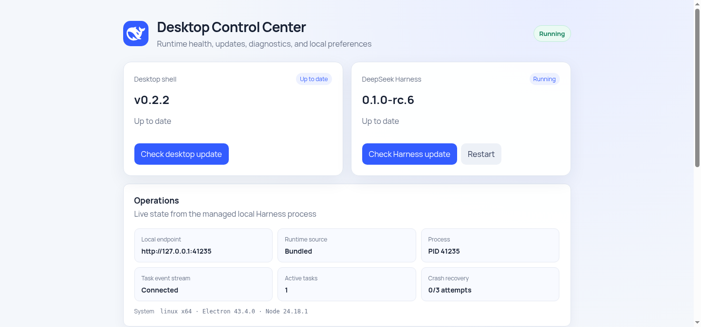

<h1 align="center">DeepSeek Harness Desktop</h1>

<p align="center">
  <strong>Run the official DeepSeek Harness experience as a self-contained desktop app.</strong><br>
  No terminal window, system-wide Node.js installation, or local build toolchain required.
</p>

<p align="center">
  <a href="https://github.com/VickylastShao/deepseek-harness-desktop/releases/latest"></a>
  <a href="https://github.com/VickylastShao/deepseek-harness-desktop/actions/workflows/build-installers.yml"></a>
  
  
  
  <a href="LICENSE"></a>
</p>

<p align="center">
  <a href="https://github.com/VickylastShao/deepseek-harness-desktop/releases/latest"><strong>Download v0.2.2</strong></a>
  · <a href="#get-started">Get started</a>
  · <a href="#troubleshooting-and-support">Support</a>
  · <a href="README.zh-CN.md">简体中文</a>
</p>

<p align="center">
  
</p>

> [!IMPORTANT]
> This is an unofficial community project, not a DeepSeek product. Upstream
> DeepSeek Harness is still a developer preview and may introduce breaking
> changes.

## Download

The current release is **v0.2.2**. Pick the normal installer for your platform;
the alternatives provide another package format where available.

| Platform | Recommended | Alternative | SHA-256 |
| --- | --- | --- | --- |
| Windows x64 | [Setup EXE](https://github.com/VickylastShao/deepseek-harness-desktop/releases/download/v0.2.2/DeepSeek-Harness-Desktop-0.2.2-win-x64.exe) | — | [checksums](https://github.com/VickylastShao/deepseek-harness-desktop/releases/download/v0.2.2/SHA256SUMS-win32-x64.txt) |
| Ubuntu/Debian x64 | [DEB](https://github.com/VickylastShao/deepseek-harness-desktop/releases/download/v0.2.2/DeepSeek-Harness-Desktop-0.2.2-linux-amd64.deb) | [AppImage](https://github.com/VickylastShao/deepseek-harness-desktop/releases/download/v0.2.2/DeepSeek-Harness-Desktop-0.2.2-linux-x86_64.AppImage) | [checksums](https://github.com/VickylastShao/deepseek-harness-desktop/releases/download/v0.2.2/SHA256SUMS-linux-x64.txt) |
| macOS Apple Silicon | [DMG](https://github.com/VickylastShao/deepseek-harness-desktop/releases/download/v0.2.2/DeepSeek-Harness-Desktop-0.2.2-mac-arm64.dmg) | [ZIP](https://github.com/VickylastShao/deepseek-harness-desktop/releases/download/v0.2.2/DeepSeek-Harness-Desktop-0.2.2-mac-arm64.zip) | [checksums](https://github.com/VickylastShao/deepseek-harness-desktop/releases/download/v0.2.2/SHA256SUMS-darwin-arm64.txt) |
| macOS Intel | [DMG](https://github.com/VickylastShao/deepseek-harness-desktop/releases/download/v0.2.2/DeepSeek-Harness-Desktop-0.2.2-mac-x64.dmg) | [ZIP](https://github.com/VickylastShao/deepseek-harness-desktop/releases/download/v0.2.2/DeepSeek-Harness-Desktop-0.2.2-mac-x64.zip) | [checksums](https://github.com/VickylastShao/deepseek-harness-desktop/releases/download/v0.2.2/SHA256SUMS-darwin-x64.txt) |

Release `v0.2.2` and earlier installers are unsigned. Windows SmartScreen and
macOS Gatekeeper may show an unknown-publisher warning. See the
[release signing setup](docs/CODE_SIGNING.md) for the enforced signing path for
future tagged releases.

<details>
<summary><strong>Verify a downloaded installer</strong></summary>

Download the checksum file from the same table, then compare it with the local
package:

```powershell
Get-FileHash .\DeepSeek-Harness-Desktop-0.2.2-win-x64.exe -Algorithm SHA256
```

```bash
sha256sum DeepSeek-Harness-Desktop-0.2.2-linux-amd64.deb
```

</details>

## Get started

1. Install and open **DeepSeek Harness Desktop**.
2. Read and accept the upstream developer-preview notice.
3. Open **Settings → Models** and configure a model provider.
4. Choose the workspace Harness is allowed to use.
5. Start a session and describe the task.

The initial workspace is your home directory. Set `DSH_DESKTOP_WORKSPACE`
before launch to use a different default.

## What the desktop app adds

DeepSeek Harness can already run from a terminal with
`npx @deepseek-ai/dsh web`. This project packages that workflow into a
conventional desktop application without forking or injecting into the
upstream Harness Web UI.

| Desktop capability | User impact |
| --- | --- |
| Self-contained runtime | Bundles Node.js and a platform-native Harness runtime, so first launch never waits for compilation or a prerequisite download. |
| One-click lifecycle | Starts Harness without a console window and keeps a single managed process. |
| System tray | Reopen, restart, check updates, open logs, or quit while the main window is hidden. |
| Background task notifications | Reports completed tasks while the window is hidden or minimized; clicking restores the app. |
| Two staged update channels | Updates Harness and the desktop shell independently without replacing the running session. |
| Bounded crash recovery | Retries unexpected exits with backoff, then stops instead of looping forever. |
| Control center and diagnostics | Shows live runtime state and exports a bounded, redacted support bundle. |
| Local navigation boundary | Loads only the managed server on its random `127.0.0.1` port. |

## What is DeepSeek Harness?

[DeepSeek Harness](https://github.com/deepseek-ai/deepseek-harness), also known
as `dsh`, is DeepSeek's open-source agent harness. Its Web UI connects model
providers, workspaces, sessions, tools, plans, and approval-sensitive
operations. Harness is built on [Cordis](https://github.com/cordiverse/cordis)
around a plugin-based architecture.

This repository supplies the desktop host, process lifecycle, updates,
diagnostics, and installers. Harness itself remains upstream. See its
[Web UI guide](https://github.com/deepseek-ai/deepseek-harness/blob/master/docs/user/guide/index.md)
and [architecture documentation](https://github.com/deepseek-ai/deepseek-harness/blob/master/docs/architecture.md)
for the authoritative product and plugin behavior.

## Product tour

<table>
  <tr>
    <td align="center"><strong>Desktop startup</strong></td>
    <td align="center"><strong>Upstream Harness first-run notice</strong></td>
  </tr>
  <tr>
    <td></td>
    <td></td>
  </tr>
</table>

The control center shown at the top separates desktop and Harness versions,
update state, process health, task-event connectivity, recovery state,
preferences, diagnostics, and local-data shortcuts. All screenshots are
captured from the real Electron pages and bundled Harness runtime with
`npm run capture:screenshots`.

## Everyday behavior

- Closing the main window hides it when **Keep running when the window closes**
  is enabled. Starting the app again restores the existing window.
- The tray **Preferences** submenu stores close-to-tray and notification
  choices. Windows and macOS also expose **Start at Login**.
- Task notifications appear only while the main window is hidden or minimized.
- Unexpected Harness exits retry after 1, 5, and 15 seconds. A fourth failure
  within five minutes opens the failure screen.

## Updates without startup delay

Launching the app never waits for a network request.

| Channel | First check | What happens in the background | Activation |
| --- | --- | --- | --- |
| Harness runtime | 30 seconds after Harness is ready, then every 6 hours | Downloads and verifies a platform-native runtime while the current session continues. | Next normal app launch |
| Desktop shell | 60 seconds after Harness is ready, then every 6 hours in signed release builds | Downloads a newer installer without interrupting Harness. | Installed after a normal quit; used on the next launch |

A failed download or integrity check leaves the active version untouched. The
bundled Harness runtime remains available as a fallback.

<details>
<summary><strong>Harness runtime verification</strong></summary>

Before staging a runtime, the updater verifies HTTPS transport, declared size,
SHA-256, npm integrity metadata, required Node.js version, the Harness CLI entry
point, and the platform-native `node-pty` module.

</details>

## Security and local data

- Renderer Node.js integration is disabled; Chromium context isolation is
  enabled.
- Navigation is restricted to the packaged loading page and the exact managed
  loopback origin.
- External HTTP and HTTPS links open in the system browser.
- Harness state, managed runtimes, staged updates, and desktop logs stay in
  Electron's per-user application-data directory.
- **Quit** stops the managed Harness process tree and cancels background
  downloads. Uninstalling does not delete user data by default.

**Export diagnostic bundle** creates a size-bounded, pattern-redacted `.tar.gz`
containing only a structured desktop report, the tail of the desktop log, and a
contents notice. It does not copy Harness sessions, the credential store, or
workspace files. Review the bundle before posting it publicly.

See the [privacy policy](PRIVACY.md) and
[code signing policy](CODE_SIGNING_POLICY.md) for the complete boundaries.

## Troubleshooting and support

| Symptom | What to do |
| --- | --- |
| Installation takes a while | Wait for the installer to expand Electron, Node.js, and the verified Harness seed. This work is done during installation so first launch stays fast. |
| Tray icon is missing | Check the taskbar, desktop-panel, or menu-bar overflow area. Starting the app again restores the existing window. |
| No task-completion notification | Allow OS notifications, keep **Desktop Notifications** enabled, and hide or minimize the main window. |
| Harness does not start | Open **Desktop Control Center**, export and review a diagnostic bundle, then attach it to an issue with reproduction steps. |

Report desktop-wrapper defects in the
[GitHub issue tracker](https://github.com/VickylastShao/deepseek-harness-desktop/issues).
For model, plugin, or Harness Web UI behavior, check the
[upstream Harness documentation](https://github.com/deepseek-ai/deepseek-harness/tree/master/docs)
first.

## Development

Node.js `24.18.1` is required. Preparing the seed downloads DeepSeek Harness
from the official npm registry and builds its native dependencies for the
current platform.

```bash
npm ci
npm test
npm run smoke:tray
npm run prepare:seed
npm run smoke:harness
npm run dist
```

Regenerate the README screenshots from a graphical desktop session:

```bash
npm run capture:screenshots
```

Generated runtime and installer directories (`runtime-seed/`,
`runtime-release/`, `build/`, and `release/`) are excluded from Git.

<details>
<summary><strong>Runtime configuration</strong></summary>

| Environment variable | Purpose | Default |
| --- | --- | --- |
| `DSH_RUNTIME_CHANNEL_URL` | Override the HTTPS runtime-channel manifest. | Embedded release channel |
| `DSH_UPDATE_DELAY_MS` | Delay before the first Harness update check. | `30000` |
| `DSH_UPDATE_INTERVAL_MS` | Interval between later Harness checks. | `21600000` |
| `DSH_DESKTOP_UPDATE_DELAY_MS` | Delay before the first desktop-shell check. | `60000` |
| `DSH_DESKTOP_UPDATE_INTERVAL_MS` | Interval between later desktop-shell checks. | `21600000` |
| `DSH_DESKTOP_WORKSPACE` | Initial Harness working directory. | User home directory |
| `DSH_RUNTIME_SEED` | Override the bundled seed for development and testing. | Packaged seed |

</details>

## Release engineering

GitHub Actions builds and smoke-tests every target on a native runner. Tagged
releases contain platform installers and SHA-256 files. The separate
[`runtime-channel`](https://github.com/VickylastShao/deepseek-harness-desktop/releases/tag/runtime-channel)
release contains the verified runtime manifest and archives used by background
Harness updates.

Future tagged releases must pass macOS Developer ID signing and notarization
plus Windows Authenticode verification before publication. Manual development
and scheduled runtime builds may remain unsigned. See
[docs/CODE_SIGNING.md](docs/CODE_SIGNING.md).

## License

DeepSeek Harness Desktop is released under the [MIT License](LICENSE).
DeepSeek Harness and bundled dependencies retain their own licenses; see
[THIRD_PARTY_NOTICES.md](THIRD_PARTY_NOTICES.md).
