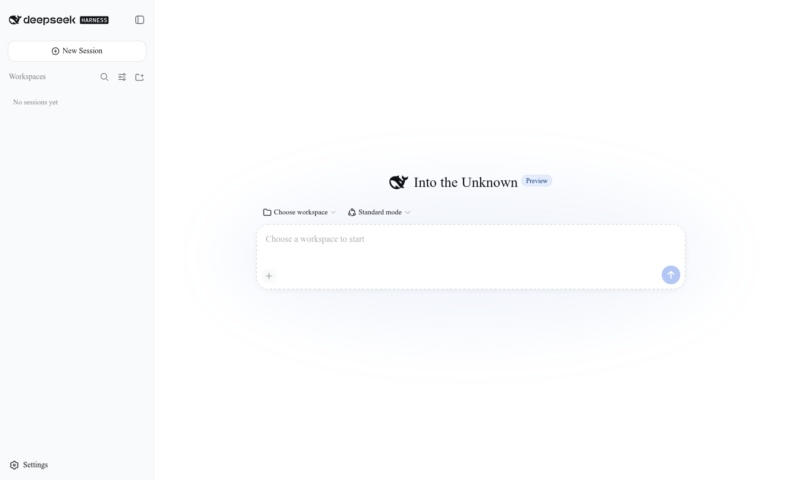
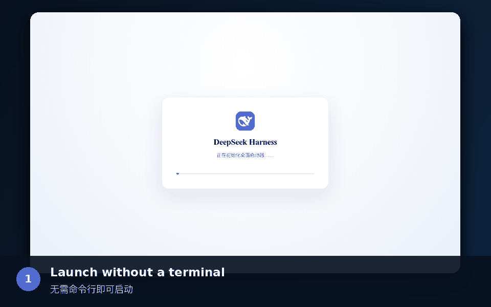

<h1 align="center">DeepSeek Harness Desktop</h1>

<p align="center">
  <strong>DeepSeek Harness, without the terminal.</strong><br>
  Run the unmodified upstream Harness Web UI in a self-contained desktop app for Windows, macOS, and Linux.
</p>

<p align="center">
  <a href="https://github.com/VickylastShao/deepseek-harness-desktop/releases/tag/v0.2.3"></a>
  <a href="https://github.com/VickylastShao/deepseek-harness-desktop/actions/workflows/build-installers.yml"></a>
  
  <a href="LICENSE"></a>
</p>

<p align="center">
  <a href="https://vickylastshao.github.io/deepseek-harness-desktop/"><strong>Download v0.2.3</strong></a>
  · <a href="#get-started">Get started</a>
  · <a href="docs/USER_GUIDE.md">User guide</a>
  · <a href="README.zh-CN.md">简体中文</a>
</p>

<p align="center">
  
</p>

> [!IMPORTANT]
> This is an unofficial community project, not a DeepSeek product. Upstream
> DeepSeek Harness is still a developer preview and may introduce breaking changes.

## Why Desktop?

| No terminal | Fast first launch | Quiet background updates |
| --- | --- | --- |
| Opens Harness without a persistent command window or system-wide Node.js installation. | Ships with a verified platform runtime, so first launch does not wait for compilation or a large download. | Checks after launch, stages verified updates without interrupting the session, and activates them after restart. |

## See it in action

<details>
<summary><strong>Play the 7-second product tour</strong></summary>

<p align="center">
  
</p>

</details>

The tour uses screenshots captured from the real Electron app:

1. Launch without a terminal.
2. Work in the unmodified upstream Harness Web UI.
3. Check runtime health, staged updates, and support tools in the control center.

## Download

The current prerelease is **v0.2.3**. Use the normal installer for your platform;
the alternative package is provided where available.

| Platform | Recommended | Alternative | SHA-256 |
| --- | --- | --- | --- |
| Windows x64 | [Setup EXE](https://github.com/VickylastShao/deepseek-harness-desktop/releases/download/v0.2.3/DeepSeek-Harness-Desktop-0.2.3-win-x64.exe) | — | [checksums](https://github.com/VickylastShao/deepseek-harness-desktop/releases/download/v0.2.3/SHA256SUMS-win32-x64.txt) |
| Ubuntu/Debian x64 | [DEB](https://github.com/VickylastShao/deepseek-harness-desktop/releases/download/v0.2.3/DeepSeek-Harness-Desktop-0.2.3-linux-amd64.deb) | [AppImage](https://github.com/VickylastShao/deepseek-harness-desktop/releases/download/v0.2.3/DeepSeek-Harness-Desktop-0.2.3-linux-x86_64.AppImage) | [checksums](https://github.com/VickylastShao/deepseek-harness-desktop/releases/download/v0.2.3/SHA256SUMS-linux-x64.txt) |
| macOS Apple Silicon | [DMG](https://github.com/VickylastShao/deepseek-harness-desktop/releases/download/v0.2.3/DeepSeek-Harness-Desktop-0.2.3-mac-arm64.dmg) | [ZIP](https://github.com/VickylastShao/deepseek-harness-desktop/releases/download/v0.2.3/DeepSeek-Harness-Desktop-0.2.3-mac-arm64.zip) | [checksums](https://github.com/VickylastShao/deepseek-harness-desktop/releases/download/v0.2.3/SHA256SUMS-darwin-arm64.txt) |
| macOS Intel | [DMG](https://github.com/VickylastShao/deepseek-harness-desktop/releases/download/v0.2.3/DeepSeek-Harness-Desktop-0.2.3-mac-x64.dmg) | [ZIP](https://github.com/VickylastShao/deepseek-harness-desktop/releases/download/v0.2.3/DeepSeek-Harness-Desktop-0.2.3-mac-x64.zip) | [checksums](https://github.com/VickylastShao/deepseek-harness-desktop/releases/download/v0.2.3/SHA256SUMS-darwin-x64.txt) |

Release `v0.2.3` and earlier installers are unsigned. Windows SmartScreen and
macOS Gatekeeper may show an unknown-publisher warning. See the
[code-signing status](docs/CODE_SIGNING.md) before installing.

<details>
<summary><strong>Verify a downloaded installer</strong></summary>

```powershell
Get-FileHash .\DeepSeek-Harness-Desktop-0.2.3-win-x64.exe -Algorithm SHA256
```

```bash
sha256sum DeepSeek-Harness-Desktop-0.2.3-linux-amd64.deb
```

</details>

## Get started

1. Install and open **DeepSeek Harness Desktop**.
2. Read and accept the upstream developer-preview notice.
3. Open **Settings → Models** and configure a model provider.
4. Choose a workspace, start a session, and describe the task.

The initial workspace is your home directory. Set `DSH_DESKTOP_WORKSPACE` before
launch to choose a different default.

## What the desktop app adds

DeepSeek Harness already runs from a terminal with `npx @deepseek-ai/dsh web`.
This project packages that workflow without forking or injecting into the
upstream Harness Web UI.

| Desktop capability | User impact |
| --- | --- |
| Native window chrome | Extends Harness to the window edge while retaining Windows snap controls and macOS traffic lights. |
| Self-contained runtime | Bundles Node.js and a platform-native Harness runtime. |
| Managed lifecycle | Starts one hidden Harness process on a random loopback port and stops it on explicit quit. |
| System tray and notifications | Keeps work available in the background and reports completed tasks while the window is hidden. |
| Independent update channels | Stages Harness and desktop-shell updates without delaying launch or replacing the active session. |
| Recovery and diagnostics | Applies bounded crash recovery and exports a size-bounded, pattern-redacted support bundle. |
| Local navigation boundary | Loads only the packaged page and the managed `127.0.0.1` origin. |

## Project boundary

[DeepSeek Harness](https://github.com/deepseek-ai/deepseek-harness), also known
as `dsh`, supplies the agent runtime, plugins, sessions, tools, and Web UI. This
repository supplies the Electron host, native integration, updates, diagnostics,
and installers. Upstream behavior remains documented by DeepSeek.

- Renderer Node.js integration is disabled and Chromium context isolation is enabled.
- External HTTP and HTTPS links open in the system browser.
- Harness state and desktop logs remain in the per-user application-data directory.
- The diagnostic bundle excludes sessions, credentials, and workspace files.

Read the [privacy policy](PRIVACY.md), [user guide](docs/USER_GUIDE.md), and
[code-signing policy](CODE_SIGNING_POLICY.md) for the complete boundaries.

## Documentation

- [User guide](docs/USER_GUIDE.md): tray behavior, updates, local data, diagnostics, and troubleshooting.
- [Development and release guide](docs/DEVELOPMENT.md): setup, configuration, media generation, and release engineering.
- [Upstream Harness documentation](https://github.com/deepseek-ai/deepseek-harness/tree/master/docs): models, plugins, tools, sessions, and Web UI behavior.

Report wrapper defects in the [issue tracker](https://github.com/VickylastShao/deepseek-harness-desktop/issues).

## Development

Node.js `24.18.1` is required.

```bash
npm ci
npm test
npm run smoke:harness
npm run dist
```

See [docs/DEVELOPMENT.md](docs/DEVELOPMENT.md) for the complete workflow.

## License

DeepSeek Harness Desktop is released under the [MIT License](LICENSE).
DeepSeek Harness and bundled dependencies retain their own licenses; see
[THIRD_PARTY_NOTICES.md](THIRD_PARTY_NOTICES.md).
