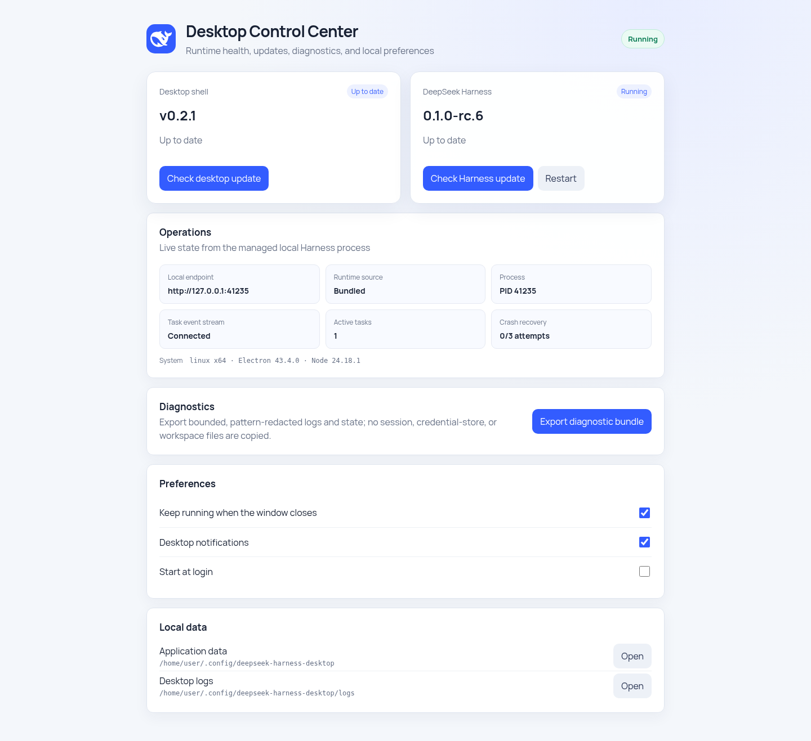

# DeepSeek Harness Desktop

[](https://github.com/VickylastShao/deepseek-harness-desktop/releases/latest)
[](https://github.com/VickylastShao/deepseek-harness-desktop/actions/workflows/build-installers.yml)
[](LICENSE)

[English](README.md) | 简体中文

像普通桌面软件一样运行 DeepSeek Harness：不需要常驻命令行窗口，也不要求用户预装 Node.js、npm 或本地编译工具链。

<p align="center">
  
</p>

> [!IMPORTANT]
> 本项目是社区维护的非官方封装，不是 DeepSeek 官方产品。上游 DeepSeek Harness 当前仍处于开发者预览阶段，后续可能出现破坏兼容性的变更。

## DeepSeek Harness 是什么？

[DeepSeek Harness](https://github.com/deepseek-ai/deepseek-harness)（命令名为 `dsh`）是 DeepSeek 开发的开源智能体框架。其默认 Web UI 支持配置模型服务、选择工作区、创建会话，并在当前权限策略要求时让用户确认敏感操作。

Harness 智能体可以在授权范围内读写工作区文件、运行命令、委派任务并维护执行计划。它由 [Cordis](https://github.com/cordiverse/cordis) 驱动，采用“一切皆插件”的架构：模型适配器、工具、持久化、沙箱策略、Web UI 和智能体循环均以可替换插件的方式组合。

有关 Harness 本身的权威说明，请阅读上游的 [Web UI 指南](https://github.com/deepseek-ai/deepseek-harness/blob/master/docs/user/guide/index.zh.md)和[架构文档](https://github.com/deepseek-ai/deepseek-harness/blob/master/docs/architecture.zh.md)。

## 为什么需要桌面封装？

官方推荐的快速启动方式是：

```bash
npx @deepseek-ai/dsh web
```

这种方式适合开发者，但需要终端、Node.js、npm，并可能因原生依赖而需要编译环境。本项目把这些运行条件封装为常规桌面应用：

| 桌面能力 | 用户获得的变化 |
| --- | --- |
| 独立运行时 | 安装包自带 Node.js 和对应平台编译的 Harness 运行时。 |
| 一键启动 | 后台启动 Harness，不显示命令行窗口。 |
| 托盘生命周期 | 关闭窗口后 Harness 继续运行；可从托盘查看/检查更新、恢复窗口、重启、查看日志或彻底退出。 |
| 本机访问边界 | 只加载应用启动的随机 `127.0.0.1` 端口。 |
| 后台暂存更新 | 当前会话继续运行时下载并校验较新的 Harness。 |
| 下次启动切换 | 正常重启时启用暂存版本，并保留安装包内运行时作为回退。 |
| 桌面外壳更新 | 正式标签构建在后台下载新版桌面外壳，正常退出后安装。 |
| 有界异常恢复 | Harness 意外退出后按退避策略恢复；连续失败时停止，避免无限重启。 |
| 桌面控制中心 | 在独立原生窗口统一展示双更新通道、运行状态、偏好设置和本地数据入口。 |
| 原生安装包 | 提供 Windows、Ubuntu、Intel macOS 和 Apple Silicon macOS 构建。 |

## 下载与安装

当前版本为 **v0.2.1**。常规安装建议直接下载下表中的推荐安装包；完整更新说明和全部文件见[最新版本](https://github.com/VickylastShao/deepseek-harness-desktop/releases/latest)。

| 平台 | 推荐安装包 | 备选格式 | SHA-256 |
| --- | --- | --- | --- |
| Windows 10/11 x64 | [安装程序 EXE](https://github.com/VickylastShao/deepseek-harness-desktop/releases/download/v0.2.1/DeepSeek-Harness-Desktop-0.2.1-win-x64.exe) | — | [校验值](https://github.com/VickylastShao/deepseek-harness-desktop/releases/download/v0.2.1/SHA256SUMS-win32-x64.txt) |
| Ubuntu/Debian x64 | [DEB](https://github.com/VickylastShao/deepseek-harness-desktop/releases/download/v0.2.1/DeepSeek-Harness-Desktop-0.2.1-linux-amd64.deb) | [AppImage](https://github.com/VickylastShao/deepseek-harness-desktop/releases/download/v0.2.1/DeepSeek-Harness-Desktop-0.2.1-linux-x86_64.AppImage) | [校验值](https://github.com/VickylastShao/deepseek-harness-desktop/releases/download/v0.2.1/SHA256SUMS-linux-x64.txt) |
| Apple Silicon macOS | [DMG](https://github.com/VickylastShao/deepseek-harness-desktop/releases/download/v0.2.1/DeepSeek-Harness-Desktop-0.2.1-mac-arm64.dmg) | [ZIP](https://github.com/VickylastShao/deepseek-harness-desktop/releases/download/v0.2.1/DeepSeek-Harness-Desktop-0.2.1-mac-arm64.zip) | [校验值](https://github.com/VickylastShao/deepseek-harness-desktop/releases/download/v0.2.1/SHA256SUMS-darwin-arm64.txt) |
| Intel macOS | [DMG](https://github.com/VickylastShao/deepseek-harness-desktop/releases/download/v0.2.1/DeepSeek-Harness-Desktop-0.2.1-mac-x64.dmg) | [ZIP](https://github.com/VickylastShao/deepseek-harness-desktop/releases/download/v0.2.1/DeepSeek-Harness-Desktop-0.2.1-mac-x64.zip) | [校验值](https://github.com/VickylastShao/deepseek-harness-desktop/releases/download/v0.2.1/SHA256SUMS-darwin-x64.txt) |

`v0.2.1` 及更早版本尚未签名，Windows SmartScreen 和 macOS Gatekeeper 可能显示“未知发布者”提示。仓库现已为后续正式标签版本增加强制签名前置检查，配置方法见[发布签名指南](docs/CODE_SIGNING.md)。

下载后可使用对应平台的校验文件核对 SHA-256：

```powershell
Get-FileHash .\DeepSeek-Harness-Desktop-0.2.1-win-x64.exe -Algorithm SHA256
```

```bash
sha256sum DeepSeek-Harness-Desktop-0.2.1-linux-amd64.deb
```

## 首次使用

1. 安装并打开 **DeepSeek Harness Desktop**。
2. 阅读并确认上游的开发者预览提示。
3. 进入 **Settings → Models** 配置模型服务。
4. 选择允许 Harness 操作的工作区。
5. 创建会话并描述需要智能体完成的任务。

桌面应用默认以用户主目录作为初始工作目录；可以在启动前通过 `DSH_DESKTOP_WORKSPACE` 指定其他目录。

关闭主窗口只会隐藏窗口，不会停止正在执行的 Harness 会话。第一次关闭时，系统会提示应用仍在托盘运行。托盘菜单会显示当前 Harness 版本及等待重启启用的版本，并支持立即检查更新、恢复窗口、重启 Harness、打开日志目录和彻底退出；再次启动桌面应用会恢复已有窗口，不会创建第二个 Harness 进程。

托盘中的“偏好设置”会持久化“关闭窗口后继续运行”和“桌面通知”选项；Windows 与 macOS 还可使用系统原生登录项启用“开机启动”。默认保持关闭窗口后继续运行、开启通知、不开机启动。

主窗口隐藏或最小化时，如果桌面外壳观测到 Harness 任务从“运行中”变为“已结束”，会发送系统原生通知；点击通知可恢复现有窗口。该行为由同一个“桌面通知”偏好控制。事件流重连不会凭空生成完成通知，桌面外壳也不会读取或修改 Harness Web UI 的页面内容。

Harness 成功启动后若意外退出，桌面外壳会分别等待 1 秒、5 秒和 15 秒后自动恢复；5 分钟内第 4 次失败将进入错误页，不会无限重启。用户手动重试或从托盘重启会清除该熔断状态。

## 软件截图

<table>
  <tr>
    <td align="center"><strong>桌面启动器</strong></td>
    <td align="center"><strong>Harness 首次运行界面</strong></td>
  </tr>
  <tr>
    <td></td>
    <td></td>
  </tr>
</table>

这些图片由仓库内的截图脚本从真实 Electron 页面和内置 Harness 运行时生成。

<p align="center">
  
</p>

从托盘打开“桌面控制中心”，可分别查看桌面外壳与 Harness 版本、访问端点、进程状态、任务事件连接、异常恢复状态和两条更新通道；还可重启 Harness、修改桌面偏好，并打开应用数据或日志目录。

“导出诊断包”会生成一个有大小上限并按模式脱敏的 `.tar.gz` 文件，其中只包含结构化桌面状态报告、桌面日志末尾和内容说明；它不会复制 Harness 会话文件、凭据库或工作区文件。向公开 Issue 上传之前仍应先检查包内三个文件。

## 无感更新行为

应用启动路径不等待网络请求。Harness 成功启动 30 秒后，后台更新器检查固定运行时通道；未发现更新时，之后每 6 小时再检查一次。

发现适用于当前操作系统和 CPU 架构的新版本后，应用在后台下载，并校验 HTTPS、文件大小、SHA-256、npm integrity、Node.js 版本、Harness CLI 和平台原生 `node-pty` 模块。当前进程不会被替换，校验通过的版本只写入 pending，并在下一次正常启动时启用。网络或完整性校验失败不会影响当前版本。

正式标签安装包还会在 Harness 就绪 60 秒后检查 GitHub Releases 中的新版 **Electron 桌面外壳**。新版 NSIS、AppImage/DEB 或已签名的 macOS 更新会在后台下载，不中断当前会话；只有用户正常退出应用后才会安装，下次启动即使用新版本。开发构建和无签名的手动构建默认关闭该通道。

## 安全与本地数据边界

- Renderer 禁用 Node.js integration，并启用 Chromium context isolation。
- 窗口只允许访问安装包内的启动页和当前 Harness 进程报告的精确回环地址。
- 外部链接只允许 HTTP/HTTPS，并交给系统浏览器打开。
- Harness 数据、活动运行时、pending 更新和日志均位于 Electron 的用户应用数据目录。
- 从系统托盘选择“彻底退出”时，应用会终止 Harness 子进程树，并取消仍在进行的后台下载。
- 卸载程序默认不删除用户数据。

发布和网络数据边界详见[隐私政策](PRIVACY.md)与[代码签名政策](CODE_SIGNING_POLICY.md)。

## 常见问题

- **安装阶段耗时较长：** 安装程序会预先解压 Electron、对应平台的 Node.js 运行时和已校验的 Harness seed，因此首次打开时不需要再下载运行时或现场编译。
- **看不到托盘图标：** 检查 Windows 任务栏、GNOME/KDE 面板或 macOS 菜单栏的隐藏/折叠区域。再次启动应用只会恢复现有窗口，不会创建第二个进程。
- **没有任务完成通知：** 允许系统向本应用发送通知，保持“桌面通知”开启，并隐藏或最小化主窗口。主窗口可见时应用有意保持静默。
- **Harness 无法启动：** 打开“桌面控制中心”，导出诊断包，检查其中三个文件后，将其连同复现步骤附加到 GitHub Issue。

## 本地开发

要求 Node.js `24.18.1`。首次准备 seed 时会从官方 npm registry 下载 DeepSeek Harness，并为当前平台构建和验证原生依赖。

```bash
npm ci
npm test
npm run smoke:tray
npm run prepare:seed
npm run smoke:harness
npm run dist
```

在图形桌面会话中重新生成 README 截图：

```bash
npm run capture:screenshots
```

`runtime-seed/`、`runtime-release/`、`build/` 和 `release/` 均为生成目录，不进入 Git。

## 运行时配置

| 环境变量 | 用途 | 默认值 |
| --- | --- | --- |
| `DSH_RUNTIME_CHANNEL_URL` | 覆盖 HTTPS 运行时更新清单。 | 安装包内置通道 |
| `DSH_UPDATE_DELAY_MS` | 首次后台检查延迟。 | `30000` |
| `DSH_UPDATE_INTERVAL_MS` | 未暂存更新时后续检查间隔。 | `21600000` |
| `DSH_DESKTOP_UPDATE_DELAY_MS` | 桌面外壳首次检查延迟。 | `60000` |
| `DSH_DESKTOP_UPDATE_INTERVAL_MS` | 桌面外壳后续检查间隔。 | `21600000` |
| `DSH_DESKTOP_WORKSPACE` | Harness 初始工作目录。 | 用户主目录 |
| `DSH_RUNTIME_SEED` | 仅供开发测试，覆盖内置 seed。 | 安装包 seed |

## 发布机制

GitHub Actions 在各目标系统的原生 runner 上构建并执行真实 Harness 启动检查。每个正式标签版本包含安装包及平台 SHA-256 文件；独立的 [`runtime-channel`](https://github.com/VickylastShao/deepseek-harness-desktop/releases/tag/runtime-channel) Release 保存后台更新器使用的运行时清单和四个平台归档。

后续正式标签版本必须同时通过 macOS Developer ID 签名与公证、Windows Authenticode 验签；缺少凭据时流水线会在发布安装包之前失败。手动开发构建和定时运行时构建仍允许无签名执行。

## 许可证

本桌面封装采用 [MIT License](LICENSE)。DeepSeek Harness 和其他依赖保留各自许可证，详见 [THIRD_PARTY_NOTICES.md](THIRD_PARTY_NOTICES.md)。
